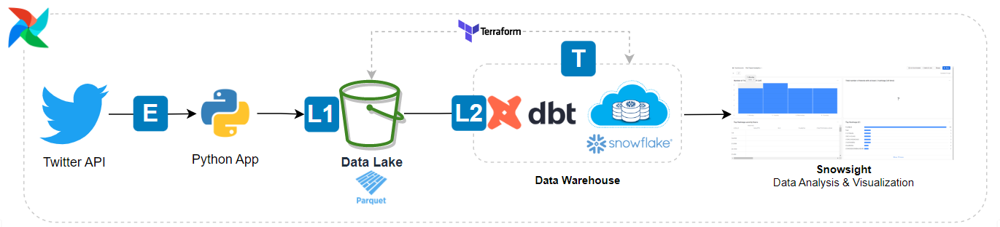
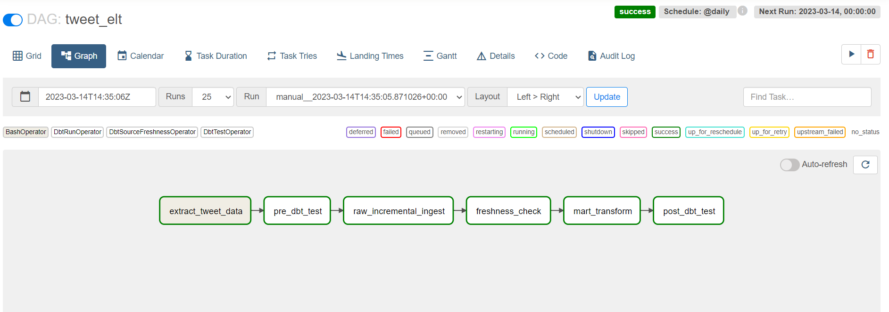
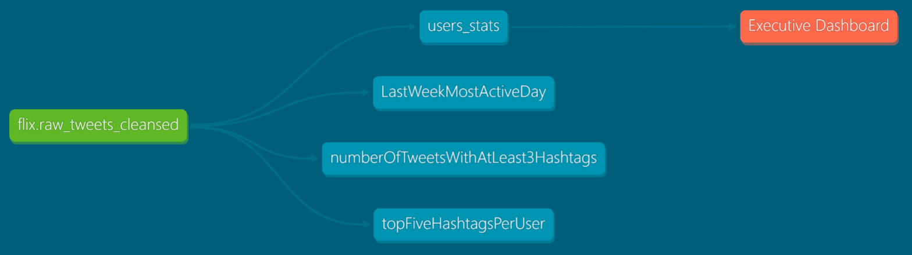
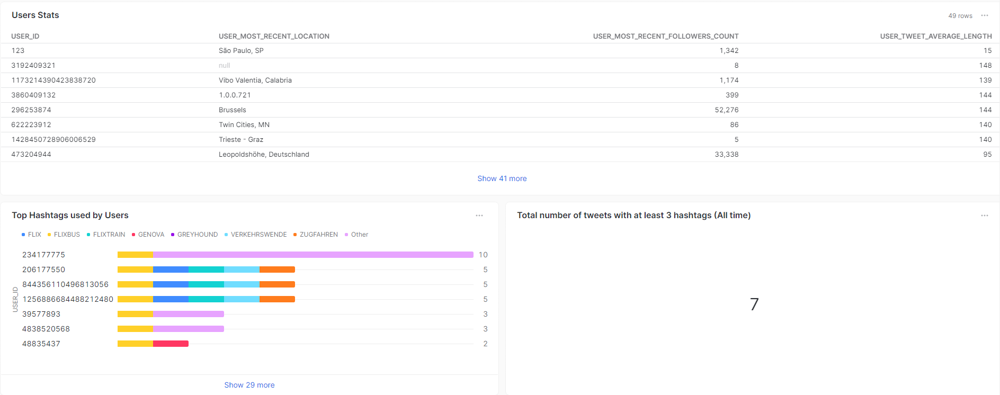

# Flix Data Engineering Use Case

# Description

This project is part of flix hiring process challenge for data enginnering positions.
The goal is to apply ETL tasks over tweet data containing any mention to flixbus.
[Modern data stack](https://www.thoughtspot.com/data-trends/best-practices/modern-data-stack#:~:text=A%20modern%20data%20stack%20is%20a%20collection%20of%20tools%20and%20cloud%20data%20technologies%20used%20to%20collect%2C%20process%2C%20store%2C%20and%20analyze%20data.) as well as Python & SQL Programming languages were selected to tackle this task. 
# About the Pipeline

## 1. Pipeline big picture


### **Extract**
* API request is made using serverless or standalone approach.
* The JSON response passes thorugh a small parsing task to gather only the data that is necessary to fulfill business needs.
  * If the request does not succeed due to lack of data or data source unavailability, the task enters in retry mode. All the application logs are available on Cloud Watch or Locally.

### **Load**

1. Extracted data is loaded to a S3 bucket in parquet format (this operation is performed by the python app).

2. By the use of dbt source command, data is copied into a Snowflake raw layer.


### **Transformations**
* With raw data at disposal in Snowflake, it's time to perform dbt operations to parse the JSON data and make it available as a friendly table format.

* Different materializations, aggregations and joins can be performed according to the business stakeholders requirements.

## 2. Airflow DAG



### **[Checkout the DAG code](airflow/dags/tweet_elt.py)**
## 3. dbt modeling



## 4. Data Viz & Analysis with Snowsight


### **[Access Dashboard](https://app.snowflake.com/sa-east-1.aws/yj68275/#/flix-tweet-analytics-dHSV3DQBj)**


## Handling issues

### **Empty results or insufficient data for analysis**

A flexible and reliable CI/CD process can be provided so that changes can be done in the code to handle the empty results/ insufficient data for analysis.(e.g: The API query constraints might be affecting the data that is retrieved and a change is required.) Also, a warning notification can be sent to the pipeline admins or any other stakeholder that will be impacted by the lack of data for analysis.

Additionaly, using dbt source freshness feature, the pipeline itself is capable of verifying how "freshed"  is the data. We can configure it to retrieve a warning or error message depending on how long the source table was has not been updated.
Check out code
```
        version: 2
        #https://docs.getdbt.com/reference/resource-properties/external
        # dbt source freshness
        version: 2
        sources:
        - name: flix
            schema: raw
            loader: s3
            tables:
            - name: raw_tweets_cleansed
                identifier: 
                loaded_at_field: tweet_created_at
                freshness:
                # Time is in UTC
                warn_after: {count: 4, period: hour}
                error_after: {count: 24, period: hour}
                filter: datediff('day', tweet_created_at, current_timestamp) < 2
            - name: raw_tweets
                description: Raw source table containing relevant tweet data pre-cleansed by python code.
                identifier: 
                loaded_at_field: raw_tweet['created_at']::timestamp
            
```

### **Changes in the data source schema**

Changes in the data source schema might not be a big concern since the design adopts a *schema-on-read* approach which provides flexibility and scalability.


The data gets loaded into the data warehouse as VARIANT data type (free of any schema constraints).


That guarantees the pipeline will not break unexpectedly due to any constraint regarding a data type change or columns addition/removal:


```
select
 $1['is_retweet']::boolean as is_retweet
,$1['tweet_created_at']::timestamp as tweet_created_at
,$1['tweet_hasthags']::array as tweet_hasthags
,$1['tweet_id']::varchar as tweet_id
,$1['tweet_text']::varchar as tweet_text
,$1['user_followers_count']::int as user_followers_count
,$1['user_id']::varchar as user_id
,$1['user_location']::varchar as user_location
,$1 as raw_json

from '@FLIX.RAW.FLIXBUS_STAGE/tweets/cleansed_tweets/'
(file_format=>flix.raw.PARQUET_FILE_FORMAT)
```


### **No Availability of destination location**

It's very rare that destination location is unavailable, both S3 and Snowflake provide 99,99% availability SLA. 
Additionaly, the design provides:

* Intermediary object storage layer (s3) minimizes the risk of data loss due to no availability of destination location.
* Airflow task retries

### **Logging & Monitoring**

Logging capabilities are provided end-to-end thorugh, logging lib, cloud watch, Snowflake query history and dbt logging. 
 


# Running the project 

* Clone the repository
* [Setup a Snowflake Trial Account](https://signup.snowflake.com/)
* Setup your credentials in dbt [profiles.yml](dbt/profiles.yml)
* AWS Setup
  * [AWS CLI configuration](https://docs.aws.amazon.com/cli/latest/userguide/getting-started-install.html) 
  * Setup a new S3 bucket in your AWS Personal Account
* Install terraform
  * https://developer.hashicorp.com/terraform/tutorials/aws-get-started/install-cli
  * Export terraform env variables using the below template
    ```
    export TF_VAR_SNOWFLAKE_TRIAL_USER="<USER>"
    export TF_VAR_SNOWFLAKE_TRIAL_ACCOUNT="<ACCOUNT>"
    export TF_VAR_SNOWFLAKE_TRIAL_REGION="<REGION>"
    export TF_VAR_SNOWFLAKE_PASSWORD="<PASSWORD>"
    ```
* [Setup S3 & Snwoflake Storage Integration](https://github.com/caiolauro/SnowIngest#explaining-how-auto-ingestion-with-snowpipe-works)
* [Setup Snowflake Objects](refs/snowflake_user_setup.sql)
* Modify JSON file path at [main.py](twitter_api/main.py)
* Modify bucket name at [main.py](twitter_api/main.py)
* Modify log file path at [logger.py](twitter_api/logger.py)
* Setup a python virtual environment

    ```
    python venv -m env
    source env/bin/activate
    ```

* Install required dependencies

    ```
    pip install -r requirements.txt
    ```

* Setup Airflow
  * Export AIRFLOW_HOME env var
  * 
    ```
    export AIRFLOW_HOME="path/to/airflow_dir"
    ```

  * Run 


    ```
    airflow standalone
    ```